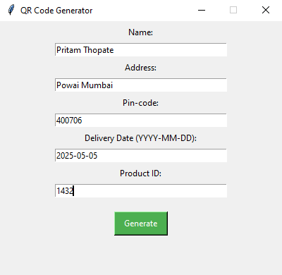
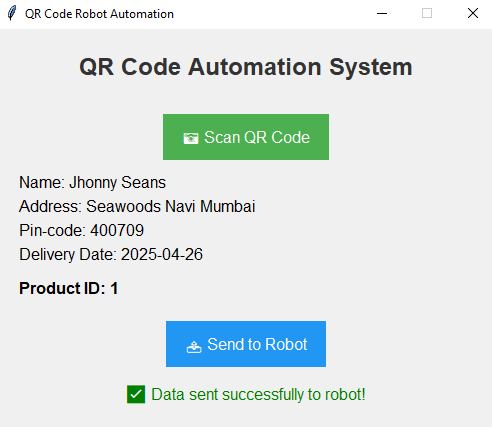

# 📦 QR-System
**QR Code Generator and Scanner for Robot Automation**

---

## 📋 Project Description
This project includes **two Python applications**:

- **QR Code Generator**: A simple GUI app (using Tkinter) that collects product delivery information (Name, Address, Pin-code, Delivery Date, Product ID) and generates a QR Code image (`qrcode.png`).

- **QR Code Scanner & Bluetooth Sender**: Another GUI app that scans QR codes using a webcam (OpenCV), extracts information, displays it on the screen, and sends the **Product ID** via Bluetooth (PySerial) to a connected robot.

---

## 🚀 Features

### QR Code Generator
- Collects delivery information through a user-friendly form.
- Generates and saves a QR Code (`qrcode.png`) with the provided details.
- Displays a success message after generation.

### QR Code Scanner & Bluetooth Sender
- Uses the computer's webcam to scan QR codes.
- Extracts and displays:
  - Name
  - Address
  - Pin-code
  - Delivery Date
  - Product ID
- Sends the extracted **Product ID** to a robot via Bluetooth.
- Shows success or failure messages for data transmission.

---

## 🖼️ App Screenshots

| QR Generator | QR Scanner |
|:------------:|:----------:|
|  |  |

---

## 🛠️ Technologies Used
- **Python**
- **Tkinter** — For creating the GUI
- **OpenCV** — For QR code scanning via camera
- **qrcode** — For generating QR codes
- **PySerial** — For Bluetooth communication
- **Regex** — For extracting specific fields from scanned QR data

---

## 🖥️ How to Run

### Prerequisites
- Python 3.x installed
- Install the required Python libraries:

## bash
pip install qrcode opencv-python pyserial

## Steps:
Generate a QR Code

Run the qr_generator.py script.

Fill in the fields and click Generate.

The QR Code will be saved as qrcode.png and displayed.

Scan QR Code and Send to Robot

Make sure your Bluetooth module (like HC-05) is paired and connected to the right COM port.

Update the bluetooth_port variable in the script to match your COM port (example: 'COM3').

Run the qr_scanner.py script.

Click Scan QR Code to capture the data.

Click Send to Robot to transmit the Product ID via Bluetooth.

## ⚠️ Notes

Make sure the Bluetooth device is properly paired and accessible.

If you face camera permission issues, allow access to your webcam.

If you dont want to connect bluetooth, then simply commentout try and catch for bluetooth serial

If your Bluetooth port is wrong, the scanner app will show an error.

## 📄 License
This project is free to use and modify!

# ✨ Thank you for checking out my project!
